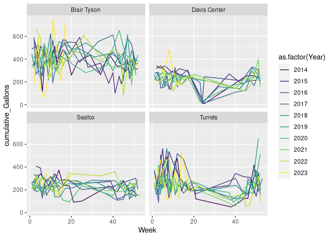
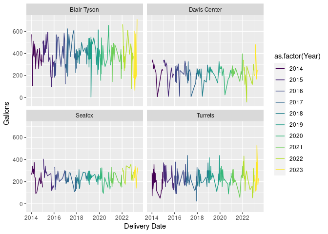
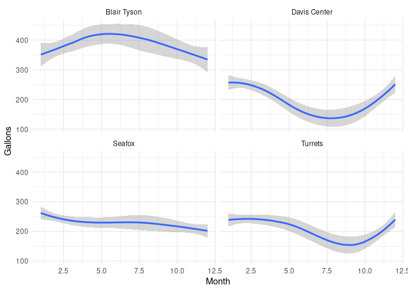
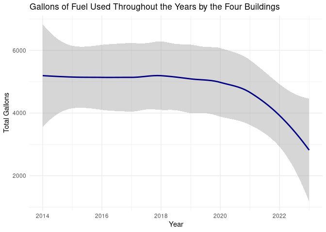
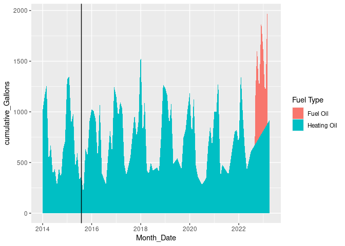
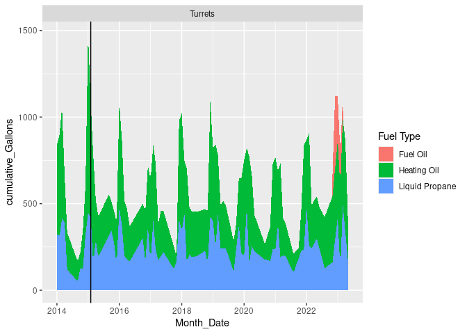
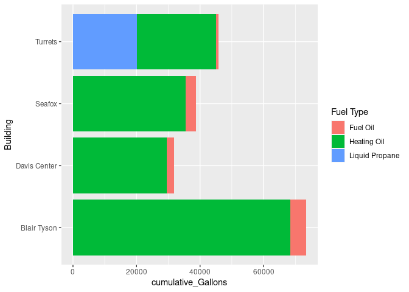

Project proposal
================
COA Energy, Sierra, Hunter, Laila

``` r
library(tidyverse)
library(broom)
install.packages(c("ggplot2", "gganimate"))
library(gifski)
library(transformr)
```

## 1. Introduction

We plan on analyzing and interpreting the energy data set to make an
assessment on how many gallons of fuel the school has used over a span
of 9-10 years. We are curious about learning how much less emissions the
school uses due to the newly installed insulation system. This will be
found by calculating how much less oil the school is using, we will be
able to calculate how much the school has decreased their CO2 emission.
This data was collected by David Gibson. The data was collected through
the yearly energy center analysis. This is a long term goal which is to
make COA fossil free, net 0, by 2030. Through this project we hope to
evaluate whether or not the school is on track to meet that goal when it
comes to energy use of buildings. Our variables include the date the
fuel was purchased, the cost, the amount of fuel in gallons. The
buildings we will focus on will be Turrets and Blair-Tyson, as well as
Seafox and Davis. The dataset is not fully up to date with the effects
of new heat system installations, nor will they be until the end of the
year so this will not be a fully comprehensive analysis until those can
updated. Although most effects from the transfer won’t be visible yet,
many systems are being fully transitioned into electric heating that is
being funded by a newly constructed solar panel array outside of Bangor
for green renewable energy. This means that the fossil fuel requirements
will be reduced to zero for buildings that have undergone heat-pump
installations or insulation. We will work with the price requirements of
fuel for multiple years of on campus buildings, as well as the price of
heat pump and insulation installations. Using this, we plan to show a
basic analysis on the saved fuel costs when compared to the overall
price of the transition.

## 2. Data

``` r
library(readxl)
energy_use <- read_excel("../data/energy_use.xlsx", na = "NA")
```

    ## New names:
    ## • `` -> `...8`
    ## • `` -> `...9`
    ## • `` -> `...10`

``` r
glimpse(energy_use)
```

    ## Rows: 2,700
    ## Columns: 10
    ## $ `Delivery Date` <dttm> 2014-01-03, 2014-01-03, 2014-01-04, 2014-01-04, 2014-…
    ## $ `Fuel Type`     <chr> "LIQUIDPROPANE", "DYEDKEROSENE", "#2HEATINGOIL", "#2HE…
    ## $ `Tank number`   <chr> "Tank14", "Tank27", "Tank24", "Tank3", "Tank5", "Tank1…
    ## $ Building        <chr> "171 Beech Hill Road", "Witchcliff Apartments", "Dorr …
    ## $ Gallons         <dbl> 10.0, 170.0, 185.3, 264.9, 281.4, 299.1, 40.9, 71.6, 8…
    ## $ `Unit Cost`     <dbl> 1.8481, 3.7304, 3.3417, 3.3417, 3.3417, 3.2998, 1.8481…
    ## $ Cost            <dbl> 18.48, 634.17, 619.22, 885.22, 940.35, 986.97, 75.59, …
    ## $ ...8            <lgl> NA, NA, NA, NA, NA, NA, NA, NA, NA, NA, NA, NA, NA, NA…
    ## $ ...9            <chr> "Tank 1", NA, "Tank 3", "Tank 4", "Tank 5", NA, "Tank …
    ## $ ...10           <chr> "Peach House", NA, "Seafox", "Cottage", "Turrets", NA,…

## 3. Ethics review

<https://docs.google.com/spreadsheets/d/17HQLm0ieg3CpGigJwEUrePDcWNnYUJZW/edit#gid=570530532>

## 3. Ethics review

The biases that could effect our data visualizations and how the data
was collected could be believing that the school has completely
transformed their heating systems to electric from fossil fuels. We are
aware that that is not the case. We are also aware that the fueled
heaters were on for a part of the year that the school was not intending
for. This is not able to be seen in the data because the fuel tanks are
no longer receiving fuel refills. We also did not collect the data
ourselves. This data was collected by David Gibson and others. We do not
need to worry about misrepresentation or misleading information when it
comes to people, there would be no negative effects on people. However,
creating incorrect data visualizations and interpretations would be
confusing.

## 4. Data analysis plan

We will use variables such as gallons, we can calculate emissions,
dates/time in years to see the difference overtime, we also plan on
touching on pricing and how much money the school has saved over time.
We will focus on the buildings on campus such as Blair-Tyson, Seafox,
Davis and Turrets. We met with David Gibson and used the advice he
shared with us throughout this process. We plan on making bar plots to
visualize and analyze which buildings use the most fuel, and see how
their fuel needs associated prices have changed overtime. We believe we
will see the most effect from heat pump and insulation installation at
Witchcliff, Seafox, Davis, and Blair-Tyson. We will use line graphs to
show their fuel uses over long periods of time. Animations may also be
able to show this change effectively due to the many years of data
available. For finer analysis we can also facet wrap graphs side by
side. On top of this, we will analyze the effectiveness of different
types of fuel, and if there is any visible differences according to
total gallons used and amount of deliveries needed. We will use
variables such as gallons, we can calculate emissions, dates/time in
years to see the difference overtime, we also plan on touching on
pricing and how much money the school has saved over time.

Summary Statistics:

``` r
image <- ggplot(data = energy_use) +
geom_bar( mapping = aes(x = Building, fill = `Fuel Type` )) +
  coord_flip()
```

``` r
#pdf(file = 'output/image.pdf')
file_path <- ('/cloud/project/extra')
ggsave(filename = "myplot.png", path = file_path, plot = image, device = "png")
```

    ## Saving 7 x 5 in image

``` r
install.packages("visdat")
```

    ## Installing package into '/cloud/lib/x86_64-pc-linux-gnu-library/4.3'
    ## (as 'lib' is unspecified)

``` r
library(visdat)
library(naniar)
```

We should label our graphs and charts. We can put the important
information in and the rest of what we were exploring later. When we
present we will export the charts/graphs.

CODE TO ORGANIZE DATA:

``` r
energy_use %>%
  filter(between(`Delivery Date`, as.Date('2022-01-01'), as.Date('2023-01-01'))) 
```

    ## # A tibble: 221 × 10
    ##    `Delivery Date`     `Fuel Type`   `Tank number` Building  Gallons `Unit Cost`
    ##    <dttm>              <chr>         <chr>         <chr>       <dbl>       <dbl>
    ##  1 2022-01-06 00:00:00 DYEDKEROSENE  Tank26        Witchcli…    62.2        3.26
    ##  2 2022-01-06 00:00:00 DYEDKEROSENE  Tank27        Witchcli…   125.         3.26
    ##  3 2022-01-06 00:00:00 LIQUIDPROPANE Tank37        Turrets …   232.         1.80
    ##  4 2022-01-06 00:00:00 LIQUIDPROPANE Tank8         Arts & S…   583.         1.80
    ##  5 2022-01-07 00:00:00 LIQUIDPROPANE Tank31        Davis Vi…    89.1        1.79
    ##  6 2022-01-07 00:00:00 #2HEATINGOIL  Tank33        PRF         179.         2.94
    ##  7 2022-01-07 00:00:00 LIQUIDPROPANE Tank35        B&G          21.1        1.79
    ##  8 2022-01-08 00:00:00 #2HEATINGOIL  Tank24        Dorr NHM     47.7        2.85
    ##  9 2022-01-12 00:00:00 LIQUIDPROPANE Tank10        Hatchery     25.4        1.84
    ## 10 2022-01-13 00:00:00 #2HEATINGOIL  Tank24        Dorr NHM    132.         2.98
    ## # ℹ 211 more rows
    ## # ℹ 4 more variables: Cost <dbl>, ...8 <lgl>, ...9 <chr>, ...10 <chr>

``` r
new_data <- energy_use %>%
   mutate(Building = case_when(Building %in% c("Turrets", "Turrets Annex") ~ "Turrets",
                            
                               TRUE ~ Building)) %>% mutate() %>%
select(-c(`...8`,`...9`,`...10`))
  #distinct(Building)
```

``` r
new_data %>%
  group_by(Building) %>%
  summarize(total_gallons = sum(Gallons, na.rm = FALSE)) %>%
arrange(desc(total_gallons))
```

    ## # A tibble: 27 × 2
    ##    Building           total_gallons
    ##    <chr>                      <dbl>
    ##  1 Arts & Sci + Gates       144394.
    ##  2 Kaelber                  103610.
    ##  3 Blair Tyson               73379.
    ##  4 Turrets                   45894.
    ##  5 Dorr NHM                  40871.
    ##  6 Seafox                    38715.
    ##  7 Davis Center              31814.
    ##  8 Davis Village             27151.
    ##  9 Witchcliff                12952.
    ## 10 PRF                       10892.
    ## # ℹ 17 more rows

``` r
new_data %>%
  group_by(Building) %>%
  summarize(total_gals = sum(Gallons, na.rm = TRUE)) %>%
  drop_na()
```

    ## # A tibble: 26 × 2
    ##    Building                    total_gals
    ##    <chr>                            <dbl>
    ##  1 171 Beech Hill Road              1783 
    ##  2 Arts & Sci + Gates             144394.
    ##  3 B&G                              8993.
    ##  4 BHF Farm House                    808.
    ##  5 BHF Main Bldg/2 Greenhouses      3393.
    ##  6 BHF New Greenhouse               6005.
    ##  7 Blair Tyson                     73379.
    ##  8 CHE Generator                     224.
    ##  9 Carriage                         6432.
    ## 10 Cottage                          6868.
    ## # ℹ 16 more rows

``` r
visdat::vis_dat(new_data)
```

<!-- -->

``` r
#class exercise to view type of variables
```

``` r
energy_use %>%
  filter(between(`Delivery Date`, as.Date('2022-01-01'), as.Date('2023-01-01'))) 
```

    ## # A tibble: 221 × 10
    ##    `Delivery Date`     `Fuel Type`   `Tank number` Building  Gallons `Unit Cost`
    ##    <dttm>              <chr>         <chr>         <chr>       <dbl>       <dbl>
    ##  1 2022-01-06 00:00:00 DYEDKEROSENE  Tank26        Witchcli…    62.2        3.26
    ##  2 2022-01-06 00:00:00 DYEDKEROSENE  Tank27        Witchcli…   125.         3.26
    ##  3 2022-01-06 00:00:00 LIQUIDPROPANE Tank37        Turrets …   232.         1.80
    ##  4 2022-01-06 00:00:00 LIQUIDPROPANE Tank8         Arts & S…   583.         1.80
    ##  5 2022-01-07 00:00:00 LIQUIDPROPANE Tank31        Davis Vi…    89.1        1.79
    ##  6 2022-01-07 00:00:00 #2HEATINGOIL  Tank33        PRF         179.         2.94
    ##  7 2022-01-07 00:00:00 LIQUIDPROPANE Tank35        B&G          21.1        1.79
    ##  8 2022-01-08 00:00:00 #2HEATINGOIL  Tank24        Dorr NHM     47.7        2.85
    ##  9 2022-01-12 00:00:00 LIQUIDPROPANE Tank10        Hatchery     25.4        1.84
    ## 10 2022-01-13 00:00:00 #2HEATINGOIL  Tank24        Dorr NHM    132.         2.98
    ## # ℹ 211 more rows
    ## # ℹ 4 more variables: Cost <dbl>, ...8 <lgl>, ...9 <chr>, ...10 <chr>

``` r
visdat::vis_miss(energy_use)
```

<!-- -->

``` r
#class exercise
```

``` r
naniar::gg_miss_var(energy_use)
```

<!-- -->

``` r
#class exercise
```

``` r
new_energy_use <- new_data %>%
filter(Building %in% c("Turrets","Seafox", "Blair Tyson", "Davis Center" )) %>%
select(-c(`Tank number`, `Unit Cost`, Cost)) %>%
  mutate(Year = year(`Delivery Date`)) %>%
  select(- `Delivery Date`) %>%
      mutate(`Fuel Type` = case_when(`Fuel Type` %in% c("SLPP#2FUELOIL", "SLPP #2 FUEL OIL") ~ "Fuel Oil",
                                 `Fuel Type` %in% c("#2HEATINGOIL", "#2 Heating Oil") ~ "Heating Oil", `Fuel Type` %in% c("LIQUIDPROPANE", "SLPLIQPROPANE") ~ "Liquid Propane",
                                  `Fuel Type` %in%
                ("DYEDKEROSENE") ~ "Dyed Kerosene",
                                 TRUE ~ `Fuel Type`))
```

``` r
glimpse(new_energy_use)
```

    ## Rows: 708
    ## Columns: 4
    ## $ `Fuel Type` <chr> "Heating Oil", "Heating Oil", "Liquid Propane", "Heating O…
    ## $ Building    <chr> "Seafox", "Turrets", "Turrets", "Davis Center", "Blair Tys…
    ## $ Gallons     <dbl> 264.9, 281.4, 71.6, 317.8, 572.7, 282.0, 234.5, 439.6, 251…
    ## $ Year        <dbl> 2014, 2014, 2014, 2014, 2014, 2014, 2014, 2014, 2014, 2014…

``` r
new_data %>%
  mutate(Building = case_when(Building == "NA" ~ NA,
                              TRUE ~ Building)) %>%
  drop_na(Building) %>%
ggplot(aes(x = Building,
           y = Gallons)) +
  geom_miss_point(alpha = 0.5)+
coord_flip()
```

<!-- -->

``` r
#class activity, this code shows percentage of missing data and where it is.
```

GRAPHS:

``` r
new_data%>% 
 filter(Building %in% c("Turrets","Seafox", "Blair Tyson", "Davis Center" )) %>%
  select(Building , Gallons, `Delivery Date`) %>%
  arrange(`Delivery Date`) %>%
  mutate(Year = year(`Delivery Date`),
         Month = month(`Delivery Date`),
         Week = week(`Delivery Date`)) %>%
  ggplot() +
  geom_line(mapping = aes(x = `Delivery Date`, y = Gallons, color = as.factor(Year))) +
  facet_wrap(~Building)+
  scale_color_viridis_d()
```

<!-- -->

``` r
new_data %>% 
 filter(Building %in% c("Turrets","Seafox", "Blair Tyson", "Davis Center" )) %>%
  select(Building , Gallons, `Delivery Date`) %>%
  arrange(`Delivery Date`) %>%
  mutate(Year = year(`Delivery Date`),
         Month = month(`Delivery Date`),
         Week = week(`Delivery Date`)) %>%
  drop_na(Gallons) %>%
  group_by(Building, Week, Year) %>% 
  summarize(Gallons = sum(Gallons, na.rm = T),
            cumulative_Gallons = cumsum(Gallons)) %>%
  ggplot() +
  geom_line(mapping = aes(x = Week, y = cumulative_Gallons, color = as.factor(Year)))+
  facet_wrap(~Building)+
  scale_color_viridis_d()
```

    ## `summarise()` has grouped output by 'Building', 'Week'. You can override using
    ## the `.groups` argument.

<!-- -->

``` r
new_data %>% 
 filter(Building %in% c("Turrets","Seafox", "Blair Tyson", "Davis Center" )) %>%
ggplot() +
geom_bar( mapping = aes(x = Building, fill = `Fuel Type` )) +
  coord_flip()+
  scale_fill_viridis_d()+
 theme_minimal()
```

<!-- -->

``` r
#fuel type by building
```

``` r
energy_use %>%
  group_by(Building) %>%
  summarize(total_gals = sum(Gallons, na.rm = TRUE)) %>%
  drop_na() %>%
ggplot(aes(x = fct_reorder(Building, total_gals), y = total_gals)) +
         geom_col() +
         labs(title = "Gallons Used by Each Building", x = "Building", y = "Number of Gallons") +
  coord_flip()
```

<!-- -->

I am not sure what this one is:

``` r
new_data%>% 
  group_by(Building, `Fuel Type`) %>%
  filter(Building %in% c("Turrets","Seafox", "Blair Tyson", "Davis Center" )) %>%
  summarize(total_gals = sum(Gallons, na.rm = TRUE)) %>%
ggplot(mapping = aes(x = Building, fill = `Fuel Type` , y = total_gals)) +
geom_col() +
  labs(title = "Gallons of Fuel Used by Each of the Four Building", y = "Total Gallons", x = "Building")+
  coord_flip()+
  scale_fill_viridis_d()+
 theme_minimal()
```

    ## `summarise()` has grouped output by 'Building'. You can override using the
    ## `.groups` argument.

<!-- -->

``` r
new_data %>% 
 filter(Building %in% c("Turrets","Seafox", "Blair Tyson", "Davis Center" )) %>%
  select(Building , Gallons, `Delivery Date`) %>%
  arrange(`Delivery Date`) %>%
  mutate(Year = year(`Delivery Date`),
         Month = month(`Delivery Date`),
         Week = week(`Delivery Date`)) %>%
  drop_na(Gallons) %>%
  group_by(Building, Week, Year) %>% 
  ggplot() +
  geom_smooth(mapping = aes(x = Month, y = Gallons)) + 
  facet_wrap(~Building)+
 theme_minimal()
```

    ## `geom_smooth()` using method = 'loess' and formula = 'y ~ x'

<!-- -->

``` r
#This graph shows use of fuel per building in gallons (not summed so just amount of fuel delivered). We can change x = Month to x = Year or x = Week. We can also change filter building to view either just one or more.
```

``` r
yearly_fuel_data = new_data %>%
  mutate(Year = year(`Delivery Date`)) %>%
   group_by(Building, Year) %>% 
  summarize(total_gallons = sum(Gallons)) %>%
   filter(Building %in% c("Turrets","Seafox", "Blair Tyson", "Davis Center" )) 
```

    ## `summarise()` has grouped output by 'Building'. You can override using the
    ## `.groups` argument.

``` r
#this code creates the dataset "yearly_fuel_data" which sums up gallon deliveries by the four building per year.
```

``` r
fuel_type_yearly <- new_data %>%
  filter(Building %in% c("Turrets","Seafox", "Blair Tyson", "Davis Center" )) %>% 
  mutate(Year = year(`Delivery Date`)) %>%
   group_by(`Fuel Type`, Year, Building) %>% 
  summarize(total_gallons = sum(Gallons)) 
```

    ## `summarise()` has grouped output by 'Fuel Type', 'Year'. You can override using
    ## the `.groups` argument.

``` r
# fuel_type_yearly2 <- fuel_type_yearly %>%
#   group_by(Building, Year, `Fuel Type`) %>%
#   summarize(total_gallon_per_building = sum(total_gallons))
```

``` r
fuel_type_yearly2 <- fuel_type_yearly %>%
  mutate(Emissions= case_when("Fuel Oil" %in% `Fuel Type` ~ total_gallons*10.19,
                              "Heating Oil" %in% `Fuel Type` ~ total_gallons*10.19,
                              "Liquid Propane" %in% `Fuel Type` ~ total_gallons*5.72))
```

``` r
# fuel_type_yearly2 %>%
#   ggplot() +
#    geom_smooth(mapping = aes(x= Year, y = Emissions, color = Building)) +
#  labs(y = expression(paste("Emissions" ~  KgCO[2], "/gallon"))) +
#   facet_wrap(~`Fuel Type`, nrow = 3)
```

``` r
# fuel_type_yearly2 %>%
#   ggplot() +
#    geom_smooth(mapping = aes(x= Year, y = Emissions)) +
#  labs(y = expression(paste("Emissions" ~  KgCO[2], "/gallon"))) +
#   facet_wrap(~Building)
```

``` r
# fuel_type_yearly2 %>%
#   ggplot() +
#    geom_smooth(mapping = aes(x= Year, y = sumEmissions)) +
#  labs(y = expression(paste("Emissions" ~  KgCO[2], "/gallon"))) +
#   facet_wrap(~Building)
#  summarize(total_gallons = sum(Gallons, na.rm = FALSE))
```

``` r
# fuel3 <- fuel_type_yearly2 %>% 
#   filter(!is.na(Emissions)) %>% 
# fuel_type_yearly3 <- fuel_type_yearly2 %>%
#   arrange(Year) %>% 
#   filter(`Fuel Type` == "Heating Oil")
# 
# anim2 <- ggplot(fuel_type_yearly2, aes(x = Year, y = Emissions, colour = Building)) +
#   geom_line()+
#   geom_point()+
#   facet_wrap(~`Fuel Type`, nrow = 3) +
#   labs(title = "Emissions Over Time of Buildings by Fuel Type",
# y = expression(paste("Emissions" ~  KgCO[2], "/gallon"))) +
#   transition_reveal(Year, range = NULL, keep_last = TRUE)
#   
# animate(anim2, renderer = gifski_renderer())
#this graph is an animation of emissions per building througout the years by fuel type
```

``` r
# saveGIF({
#   for (i in unique(data$Year)) {
#     print(animation + transition_states(Year == i))
#   }
# }, movie.name = "anim2.gif", interval = 0.2, ani.width = 600, ani.height = 400)
```

``` r
yearly_fuel_data %>%
  ggplot() +
  geom_smooth(mapping = aes(x = Year, y = total_gallons), 
              color = "navy")+
  labs(title = "Gallons of Fuel Used Throughout the Years by the Four Buildings", y = "Total Gallons", x = "Year") +
 theme_minimal()
```

    ## `geom_smooth()` using method = 'loess' and formula = 'y ~ x'

<!-- -->

``` r
#this graph shows the total gallons used yearly by all the four buildings we are focusing on. We can set the data to be "data" instead of "yearly_fuel_data" if we wanted to see the graph for all buildings. It is pretty cool as it shows the decrease of fuel usage.
```

``` r
yearly_fuel_data %>%
  ggplot() +
  geom_smooth(mapping = aes(x = Year, y = total_gallons), 
              color = "navy") +
  labs(title = "Gallons of Fuel Used Throughout the Years by Each of the Four Buildings", y = "Total Gallons", x = "Year")+
  facet_wrap(~Building)+
 theme_minimal()
```

    ## `geom_smooth()` using method = 'loess' and formula = 'y ~ x'

<!-- -->

``` r
#this graph shows the total gallons used yearly by each of the four buildings we are focusing on.
```

``` r
new_data%>% 
 filter(Building %in% c("Turrets")) %>%
  select(Building , Gallons, `Delivery Date`) %>%
  arrange(`Delivery Date`) %>%
  mutate(Year = year(`Delivery Date`),
         Month = month(`Delivery Date`),
         Week = week(`Delivery Date`)) %>%
  drop_na(Gallons) %>%
  group_by(Building, Week, Year) %>% 
  summarize(Gallons = sum(Gallons, na.rm = T),
            cumulative_Gallons = cumsum(Gallons)) %>%
  ggplot() +
  geom_line(mapping = aes(x = Week, y = cumulative_Gallons, color = as.factor(Year)))+
  facet_wrap(~Year)
```

    ## `summarise()` has grouped output by 'Building', 'Week'. You can override using
    ## the `.groups` argument.

<!-- -->

``` r
new_data %>% 
 filter(Building %in% c("Davis Center")) %>%
  select(Building , Gallons, `Delivery Date`) %>%
  arrange(`Delivery Date`) %>%
  mutate(Year = year(`Delivery Date`),
         Month = month(`Delivery Date`),
         Week = week(`Delivery Date`)) %>%
  drop_na(Gallons) %>%
  group_by(Building, Week, Year) %>% 
  summarize(Gallons = sum(Gallons, na.rm = T),
            cumulative_Gallons = cumsum(Gallons)) %>%
  ggplot() +
  geom_line(mapping = aes(x = Week, y = cumulative_Gallons, color = as.factor(Year)))+
  facet_wrap(~Year)
```

    ## `summarise()` has grouped output by 'Building', 'Week'. You can override using
    ## the `.groups` argument.

<!-- -->

``` r
new_data %>% 
 filter(Building %in% c("Blair Tyson")) %>%
  select(Building , Gallons, `Delivery Date`) %>%
  arrange(`Delivery Date`) %>%
  mutate(Year = year(`Delivery Date`),
         Month = month(`Delivery Date`),
         Week = week(`Delivery Date`)) %>%
  drop_na(Gallons) %>%
  group_by(Building, Week, Year) %>% 
  summarize(Gallons = sum(Gallons, na.rm = T),
            cumulative_Gallons = cumsum(Gallons)) %>%
  ggplot() +
  geom_line(mapping = aes(x = Week, y = cumulative_Gallons, color = as.factor(Year)))+
  facet_wrap(~Year)
```

    ## `summarise()` has grouped output by 'Building', 'Week'. You can override using
    ## the `.groups` argument.

<!-- -->

``` r
new_data %>% 
 filter(Building %in% c("Seafox")) %>%
  select(Building , Gallons, `Delivery Date`) %>%
  arrange(`Delivery Date`) %>%
  mutate(Year = year(`Delivery Date`),
         Month = month(`Delivery Date`),
         Week = week(`Delivery Date`)) %>%
  drop_na(Gallons) %>%
  group_by(Building, Week, Year) %>% 
  summarize(Gallons = sum(Gallons, na.rm = T),
            cumulative_Gallons = cumsum(Gallons)) %>%
  ggplot() +
  geom_line(mapping = aes(x = Week, y = cumulative_Gallons, color = as.factor(Year)))+
  facet_wrap(~Year)
```

    ## `summarise()` has grouped output by 'Building', 'Week'. You can override using
    ## the `.groups` argument.

<!-- -->

``` r
new_data %>% 
  filter(Building %in% c("Davis Center", "")) %>%
  select(Building , Gallons, `Delivery Date`, `Fuel Type`) %>%
  arrange(`Delivery Date`) %>%
  mutate(Year = year(`Delivery Date`),
         Month = month(`Delivery Date`),
         Week = week(`Delivery Date`)) %>%
  mutate(Month_Date = floor_date(`Delivery Date`, unit = "month")) %>%
  drop_na(Gallons) %>%
  group_by(Building, Month_Date, Year, `Fuel Type`,Gallons) %>% 
  summarize(Gallons = sum(Gallons, na.rm = T),
            cumulative_Gallons = cumsum(Gallons)) %>%
  ggplot() +
  geom_area(mapping = aes(x = Month_Date, y = cumulative_Gallons, fill = `Fuel Type`)) +
  geom_vline(aes(xintercept = Month_Date[20]))
```

    ## `summarise()` has grouped output by 'Building', 'Month_Date', 'Year', 'Fuel
    ## Type'. You can override using the `.groups` argument.

<!-- -->

``` r
new_data %>% 
  filter(Building %in% c("Blair Tyson", "")) %>%
  select(Building , Gallons, `Delivery Date`, `Fuel Type`) %>%
  arrange(`Delivery Date`) %>%
  mutate(Year = year(`Delivery Date`),
         Month = month(`Delivery Date`),
         Week = week(`Delivery Date`)) %>%
  mutate(Month_Date = floor_date(`Delivery Date`, unit = "month")) %>%
  drop_na(Gallons) %>%
  group_by(Building, Month_Date, Year, `Fuel Type`) %>% 
  summarize(Gallons = sum(Gallons, na.rm = T),
            cumulative_Gallons = cumsum(Gallons)) %>%
  ggplot() +
  geom_area(mapping = aes(x = Month_Date, y = cumulative_Gallons, fill = `Fuel Type`)) +
  geom_vline(aes(xintercept = Month_Date[20]))
```

    ## `summarise()` has grouped output by 'Building', 'Month_Date', 'Year'. You can
    ## override using the `.groups` argument.

<!-- -->

``` r
new_data %>% 
  filter(Building %in% c("Seafox")) %>%
  select(Building , Gallons, `Delivery Date`, `Fuel Type`) %>%
  arrange(`Delivery Date`) %>%
  mutate(Year = year(`Delivery Date`),
         Month = month(`Delivery Date`),
         Week = week(`Delivery Date`)) %>%
  mutate(Month_Date = floor_date(`Delivery Date`, unit = "month")) %>%
  drop_na(Gallons) %>%
  group_by(Building, Month_Date, Year, `Fuel Type`) %>% 
  summarize(Gallons = sum(Gallons, na.rm = T),
            cumulative_Gallons = cumsum(Gallons)) %>%
  ggplot() +
  geom_area(mapping = aes(x = Month_Date, y = cumulative_Gallons, fill = `Fuel Type`)) +
  geom_vline(aes(xintercept = Month_Date[20])) +
  facet_wrap(~Building)
```

    ## `summarise()` has grouped output by 'Building', 'Month_Date', 'Year'. You can
    ## override using the `.groups` argument.

<!-- -->

``` r
new_data%>% 
  filter(Building %in% c("Turrets")) %>%
  select(Building , Gallons, `Delivery Date`, `Fuel Type`) %>%
  arrange(`Delivery Date`) %>%
  mutate(Year = year(`Delivery Date`),
         Month = month(`Delivery Date`),
         Week = week(`Delivery Date`)) %>%
  mutate(Month_Date = floor_date(`Delivery Date`, unit = "month")) %>%
  drop_na(Gallons) %>%
  group_by(Building, Month_Date, Year, `Fuel Type`) %>% 
  summarize(Gallons = sum(Gallons, na.rm = T),
            cumulative_Gallons = cumsum(Gallons)) %>%
  ggplot() +
  geom_area(mapping = aes(x = Month_Date, y = cumulative_Gallons, fill = `Fuel Type`)) +
  geom_vline(aes(xintercept = Month_Date[20])) +
  facet_wrap(~Building)
```

    ## `summarise()` has grouped output by 'Building', 'Month_Date', 'Year'. You can
    ## override using the `.groups` argument.

<!-- -->

``` r
new_data %>% 
 filter(Building %in% c("Turrets","Seafox", "Blair Tyson", "Davis Center" )) %>%
  select(Building , Gallons, `Delivery Date`, `Fuel Type`) %>%
  arrange(`Delivery Date`) %>%
  mutate(Year = year(`Delivery Date`),
         Month = month(`Delivery Date`),
         Week = week(`Delivery Date`)) %>%
  drop_na(Gallons) %>%
  group_by(Building, Week, Year, `Fuel Type`) %>% 
  summarize(Gallons = sum(Gallons, na.rm = T),
            cumulative_Gallons = cumsum(Gallons)) %>%
ggplot() + 
  geom_col(aes(x = Building, y = cumulative_Gallons, fill = `Fuel Type`)) +
  coord_flip()
```

    ## `summarise()` has grouped output by 'Building', 'Week', 'Year'. You can
    ## override using the `.groups` argument.

<!-- -->
